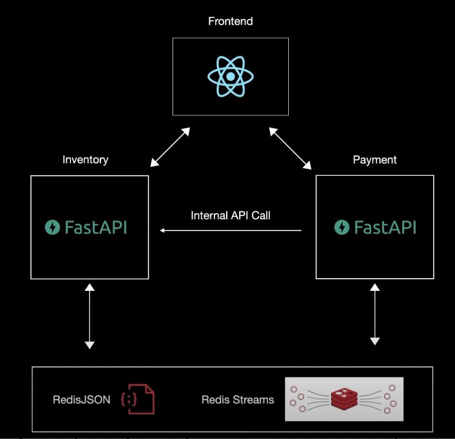

<p align="center">
  
</p>

```
// To create a virtual environment on mac

python3 -m venv venv
// step to enable vitual environmant in vs code
view -> command palette -> python:select interpreter -> ./venv/bin/python

we also need to enable virtual environment in terminal
source venv/bin/activate
```

```
//list all packages installed in virtual environment
pip freeze
```
